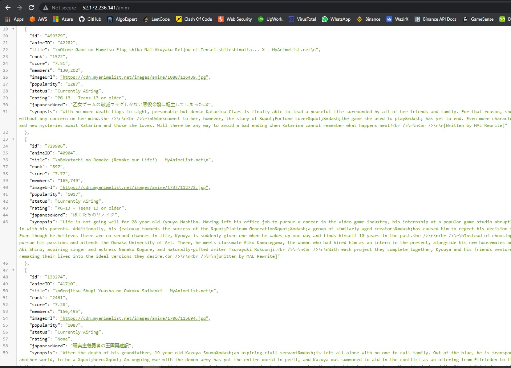
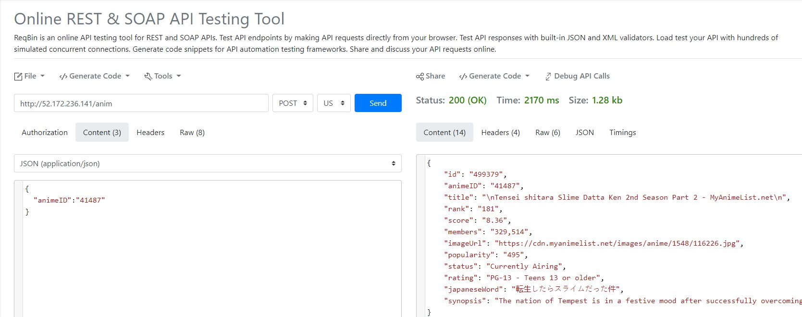
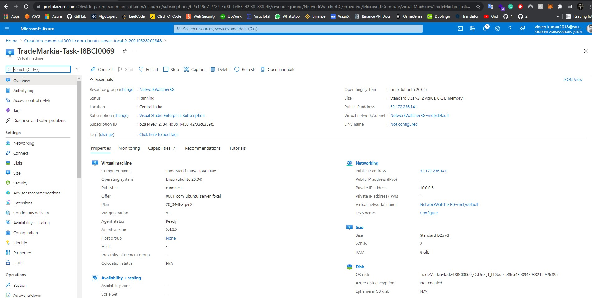
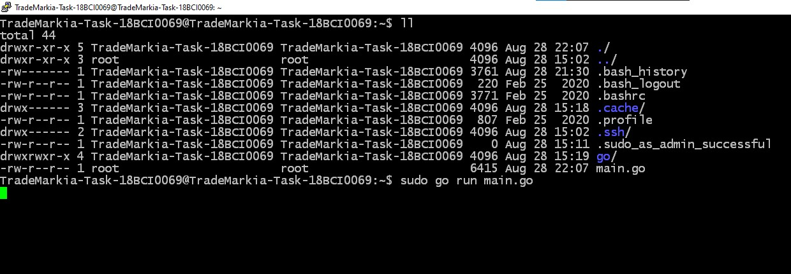
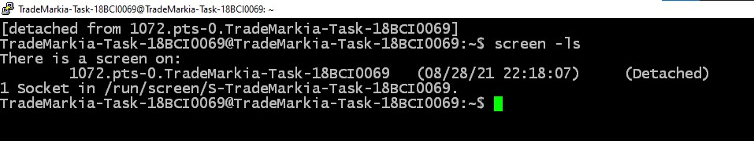

<h1 align="center">
  <br/>
  Golang Anime API EndPoint ( MyAnimeList.net )
</h1>
<p align="center">An api project which can retrieve anime details from MyAnimeList.net by parsing animeID in post request and also store it in a structure database. Project also deployed on cloud on azure instance at http://52.172.236.141/anim</p>

## ⚡️ Installation Tutorial
1) First of all, [download](https://golang.org/dl/) Golang.
2) Then install a mux module ( Used for HTTP request handling POST and GET operations )
```sh
sudo go get -u github.com/gorilla/mux
```
3) Then clone this directory in your linux instance using gitclone.
4) Run the server using the following command
```sh
sudo go run main.go
```
5) If you want to run the server in background and close the terminal then you need to use the screen command
```sh
sudo apt-get install screen
screen
```
6) After executing above command you will be in another terminal which can be minimize using the CTRL A+D command and then exit the terminal.
7) The project here is deployed on Azure Cloud platform.
8) You can access link here: http://52.172.236.141/anim

## Code Performance Metrics
1) Why this code is faster than usual web scraping method?

ANS) Here the response recorded from the MyAnimeList.net is stored in a string object and object is directly manipulated to extract all the data within second of time. Instead of using traditional scraping method such as selenium on chrome or mozilla. This method is much faster as it directly manipulate reponse on lower level. This method will be less intensive on RAM also.

```sh
Time Taken Per Request: 2100 ms average
Response Space: 1.3 KB average
```

## Infomation About Project

* Structure Of the Data stored in JSON format.
```go
type animeStruct struct {
	ID           string `json:"id"`
	AnimeID      string `json:"animeID"`
	Title        string `json:"title"`
	Rank         string `json:"rank"`
	Score        string `json:"score"`
	Members      string `json:"members"`
	ImageUrl     string `json:"imageUrl"`
	Popularity   string `json:"popularity"`
	Status       string `json:"status"`
	Rating       string `json:"rating"`
	JapaneseWord string `json:"japaneseWord"`
	Synopsis     string `json:"synopsis"`
}

```

* Sample Manipulation Of Response Code to extract data out of HTML tags.
```go
func getTitle(body string) string { // fetch title of anime from response passed in parameter

	startPoint := "<title>"
	endPoint := strings.Split(string(body), startPoint)
	return (strings.Split(string(endPoint[1]), "</title>"))[0]
}
```

* The following is the code snippet for HTTP router requests in the main.go file. These are the following paths defined.
```go
func main() {
	r := mux.NewRouter()

	anim = append(anim, animeStruct{ID: "1",
		AnimeID:      "1",
		Title:        "-",
		Rank:         "-",
		Score:        "-",
		Members:      "-",
		ImageUrl:     "#",
		Popularity:   "-",
		Status:       "-",
		Rating:       "-",
		JapaneseWord: "-",
		Synopsis:     "-"})

	r.HandleFunc("/anim", getData).Methods("GET")        // GET request method to retrieve all the data available in the structure database
	r.HandleFunc("/anim/{id}", getDataId).Methods("GET") // GET request method with id paramater in the url to get a specific anime details pre-stored in the database.
	r.HandleFunc("/anim", postData).Methods("POST")      // POST request method to retreive anime data from animeID which is passed in JSON form and then resolved in backend from postData function

	log.Fatal(http.ListenAndServe(":80", r)) // To log all the server fatal errors if encountered
}
```

* Following is the post request payload to get the anime details. Here ***41487*** can be changed accordingly to get other anime details.
```sh
{
	"animeID": "41487"
}
```

## Screenshots Of Project

### 1. Response Result
> #### Recorded responses in JSON format
> 
>

### 2. API Metrics
> #### Performance metrics done on https://reqbin.com Post Request is made using this site.
> 
>

### 3. Cloud Deployment Details
> #### Azure Instance Details on which the api server is deployed on. Address: http://52.172.236.141/anim
> 
>

### 4. Server Execution
> #### Server Execute commands on linux instance
> 
>

### 5. Persistance run in background of API
> #### Screen command to run process in background persistantly 24x7
> 
>
